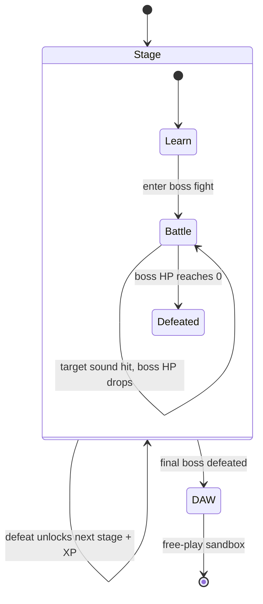

# Synthehol: Learn-to-DAW Progression with Boss Battles

## Summary

Turn Synthehol from a flat, all-controls-visible synth into a guided progression
that grows a cold beginner from their first tone into a full DAW. Each stage
teaches one synthesis concept and ends in a **boss fight** — a progressively
grosser alien cyborg you damage by sculpting that stage's target sound. Defeating
a boss unlocks the next capability; clearing the final boss opens a full free-play
DAW. The complete vision (oscillator → filter → envelope → LFO → noise → second
oscillator → polyphony → sequencer → MIDI) is captured here as a phased roadmap,
with the progression framework and the existing four modules built first.

---

## Problem Frame

Synthehol today shows all four synthesis modules at once (Oscillator, Filter,
Envelope, LFO). For someone who already understands subtractive synthesis that's
fine, but for the intended audience — a curious beginner who lands on a public URL
with no one to explain it — a wall of sliders is intimidating and gives no reason
to touch any particular control or any sense of where to start. The existing
per-control teaching panel explains *what* a control does once you click it, but
nothing pulls a newcomer through the concepts in order or gives them a reason to
care. The result is a tool that teaches only those who already know enough to
explore it.

The product is also named "Synthehol DAW" but is not a DAW — there's no
sequencing, polyphony, or external I/O. The growth path from teaching toy to real
instrument is latent in the name but unbuilt.

---

## Key Decisions

- **Boss fights are the dramatized capstone of each stage's challenge.** Rather
  than a separate game system, each boss reuses the synthesis-challenge engine:
  hitting the stage's per-stage target sound drains the boss's health. This keeps
  the game deterministic, teachable, and cheap to author — every fight is "make
  this specific kind of sound," dressed as combat.

- **"Beautiful" is defined per stage, not by a generic beauty algorithm.** Damage
  comes from the live synth parameter state meeting that stage's concrete sonic
  goal (e.g., the Filter boss takes damage when you open the cutoff bright). A
  global "consonance/beauty" detector was considered and rejected as vague to tune
  and weakly tied to the lesson.

- **Full DAW vision, phased roadmap.** Everything is in scope, but the doc
  sequences the build: the progression framework + boss engine + Act I ship first;
  later acts follow as committed, phased work rather than one monolithic release.

- **Making sound is never gated; only concepts unlock.** The keyboard plays from
  the first second. Progression locks *learning stages*, never the ability to make
  noise — a locked-down first screen would kill a public beginner's curiosity.

- **Challenge type evolves across acts.** Act I–II bosses use parameter-threshold
  targets; performance stages (polyphony, sequencer) use action-based targets
  ("play a 3-note chord"); hardware/tool features (MIDI) never hard-gate. The
  engine is built data-driven so a future match-the-sound ear-training type can be
  added without rework.

- **Boss art is rendered in-app (Canvas/SVG), not imported image files.** This
  respects the project's no-build constraint and its CSP (`img-src 'self'`).
  Creatures are drawn and animated in code, reacting to the player's sound.

- **Completion-gated unlocks; XP is reward, not gate.** Defeating the boss is the
  gate. XP accumulates as a visible score for satisfaction and feedback but never
  blocks progress.

---

## The Progression Ladder

Each stage introduces one capability and ends in one boss. Bosses escalate in
grossness; the last is a climactic finale. (Boss names below are illustrative
flavor, not committed copy.)

| # | Act | Stage / capability | Boss role |
|---|---|---|---|
| 1 | I — Make a tone | Oscillator (waveforms, octave, detune) | first contact |
| 2 | I | Filter (type, cutoff, resonance) | e.g. *Vorth, the Muffled* |
| 3 | I | Envelope (ADSR) | shape-shifter |
| 4 | I | LFO (target, rate, depth) | the writher |
| 5 | II — Richer sound | Noise source (white/pink) | static-spawn |
| 6 | II | Second oscillator (detune/stacking) | the twin |
| 7 | III — Play like an instrument | Polyphony (chords) | the swarm |
| 8 | IV — Become a DAW | Step sequencer / patterns | the machine |
| 9 | IV | MIDI in/out | climactic final boss |

Defeating boss 9 opens the **DAW sandbox** — all capabilities visible at once for
free play.

---

## Requirements

### Progression & unlocking

- R1. The app opens in a guided progression starting at the Oscillator stage; all later stages start locked.
- R2. The on-screen and computer keyboard play sound from first load; making sound is never gated by progression.
- R3. A stage unlocks the next only when its boss is defeated, and stages unlock strictly in ladder order.
- R4. Locked stages are visible but dimmed with a "coming next" teaser rather than hidden.
- R5. Progress (unlocked stages, current stage, XP) persists across reloads via `localStorage`, with a user-accessible reset control.
- R6. After the final boss is defeated, the app graduates into a free-play sandbox exposing all unlocked capabilities at once.

### Challenge & boss battles

- R7. Each stage culminates in a boss fight that *is* the stage's ears-first challenge: the boss has a health bar, and producing the stage's target sound while playing damages it.
- R8. The target sound ("beautiful" for that stage) is defined per stage by its concept; damage is driven by the live synth parameter state meeting that target, not a generic beauty algorithm.
- R9. Defeating a boss is what completes the stage and triggers the next unlock and the XP reward.
- R10. Bosses are alien cyborgs that grow progressively grosser across the ladder, rendered in-app and visibly reacting to the player's sound (taking damage, flinching, dissolving on defeat).
- R11. Each boss shows short in-character taunt/coaching copy that doubles as a hint toward the target sound.
- R12. The challenge/boss engine is data-driven so new challenge types (e.g., match-the-sound ear-training) and new bosses can be added without reworking it.
- R13. The final stage's boss is a climactic finale, and defeating it is the trigger that opens the DAW sandbox (R6).

### XP & teaching

- R14. A visible XP score accumulates as bosses are damaged and defeated; XP is a reward signal and never gates an unlock.
- R15. The existing teaching panel keeps explaining each control, and within a stage frames its explanations around the active boss's target sound.

### Capability stages

- R16. Act I covers the existing modules — Oscillator, Filter, Envelope, LFO — each as its own stage and boss.
- R17. Act II adds a Noise source and a second Oscillator as new stages and bosses.
- R18. Act III adds Polyphony (playing chords) as a stage and boss.
- R19. Act IV adds a Step Sequencer and MIDI in/out as stages.
- R20. Hardware- or tool-dependent capabilities (MIDI in/out especially) unlock on reaching their stage without a hard challenge gate; a player with no MIDI device is never soft-locked, and any task there is optional.

---

## Key Flows

- F1. Stage boss loop
  - **Trigger:** Player enters an unlocked stage.
  - **Steps:** Teaching panel introduces the stage's concept and the boss appears with a taunt/hint → player adjusts that stage's controls and plays notes → when the live sound meets the stage's target, the boss takes damage → repeated/sustained matching play drains its health → at zero HP the boss is defeated.
  - **Outcome:** Next stage unlocks, XP is awarded, the defeated boss animates out.
  - **Covers:** R7, R8, R9, R10, R11, R14.

- F2. Cold first run
  - **Trigger:** A first-time visitor lands on the public URL with no prior state.
  - **Steps:** App shows the Oscillator stage active with later stages dimmed → visitor plays a note immediately and hears sound → the first boss prompts them toward the stage's target → they explore waveform/octave/detune to land it.
  - **Outcome:** Visitor reaches and defeats the first boss without external instruction.
  - **Covers:** R1, R2, R4, R7.

- F3. Graduation
  - **Trigger:** Final boss defeated.
  - **Steps:** Climactic defeat animation → progression UI gives way to the full sandbox with every capability visible.
  - **Outcome:** Player has a complete DAW for free play; progress is preserved.
  - **Covers:** R6, R13.

---

## Acceptance Examples

- AE1. **Covers R7, R8.** Given the Filter boss is active with a dull target tone, when the player raises cutoff above the stage threshold while playing a note, then the boss loses health; when cutoff stays below the threshold, no damage is dealt.
- AE2. **Covers R3.** Given the Envelope stage (3) is the current frontier, when the player tries to open the LFO stage (4), then it remains locked until the Envelope boss is defeated.
- AE3. **Covers R2.** Given a brand-new session with only the Oscillator stage unlocked, when the player presses a key, then a tone sounds — no stage needs to be completed first.
- AE4. **Covers R20.** Given the MIDI stage with no MIDI device connected, when the player reaches it, then it unlocks and the player can proceed; the MIDI task is presented as optional rather than blocking.
- AE5. **Covers R5.** Given the player has unlocked through stage 5 with accumulated XP, when they reload the page, then unlocked stages and XP are restored; when they use the reset control, then progress returns to the Oscillator stage with zero XP.

---

## Phased Roadmap

All phases are committed; they define build order, not optionality.

| Phase | Scope | Notes |
|---|---|---|
| 1 | Progression framework + boss/challenge engine + XP + `localStorage` persistence + Act I (the four existing modules re-framed as stages and bosses) | Independently shippable and fun on its own; proves the whole concept |
| 2 | Act II — Noise source, second Oscillator | First net-new synthesis capabilities and bosses |
| 3 | Act III — Polyphony | Introduces action-based challenge type; requires voice-management rework |
| 4 | Act IV — Step sequencer, MIDI in/out, climactic final boss, DAW sandbox graduation | Completes the "becomes a DAW" arc |

---

## Success Criteria

- A first-time visitor with no instructions can go from landing → playing a note → understanding and defeating the first boss unaided.
- Each stage teaches its concept well enough that a player could say what the control does in plain words afterward.
- The progression reads as a game (the boss fights land emotionally), not a checklist with a theme.
- Phase 1 stands on its own as a complete, enjoyable experience before any later act exists.

---

## Dependencies / Assumptions

- Web Audio API — already the basis of the engine; no new audio dependency for Acts I–III.
- Web MIDI API — needed only for the MIDI stage; browser support and device presence vary, which is why MIDI never hard-gates (R20).
- Canvas 2D / inline SVG for boss rendering, constrained by the project's no-build setup and CSP (`img-src 'self'`) — no external image assets without a CSP change.
- No persistence exists today; `localStorage` is introduced for progression state (R5).
- The engine is currently monophonic (single oscillator + amp envelope); polyphony (R18) requires a voice-management rework, surfaced here as a known cost.

---

## Outstanding Questions

### Deferred to planning

- Exact per-stage target criteria and thresholds, and how a "matching" sound is sampled/detected while the player plays.
- Boss art production approach (hand-authored SVG vs. procedural Canvas) and how many animation states each boss needs.
- Polyphony voice architecture, given today's single-voice engine.
- Sequencer data model and timing/clock source.
- Whether XP drives any meta-progression beyond a visible score.

(No questions block planning — the product shape is settled.)

---

## Sources / Research

- `src/controls.js` — every control change funnels through `wire()` / `wireToggleGroup()`, each already firing a known teaching key (e.g. `'osc-wave'`); the single choke point to instrument "target met" / boss damage.
- `src/state.js` — the single `S` parameter object; progression can watch it to evaluate stage targets.
- `src/audio.js` — signal chain and `applyLFORouting()`; audio lazily starts on first key press, so the keyboard-always-live requirement (R2) is already compatible.
- `index.html` — the four modules are discrete sections (`#mod-osc`, `#mod-filter`, `#mod-adsr`, `#mod-lfo`), a natural map to stages for locking/dimming.
- `src/teaching.js` — existing `TEACHINGS` lookup keyed by control id; the boss/teaching copy can extend this pattern.
- `src/canvas.js` — reusable drawing primitives that boss rendering can build on within the no-build/CSP constraints.
- `CLAUDE.md` — product philosophy ("fun first, accurate second"), no-build architecture, and the CSP that shapes the in-app art decision.
