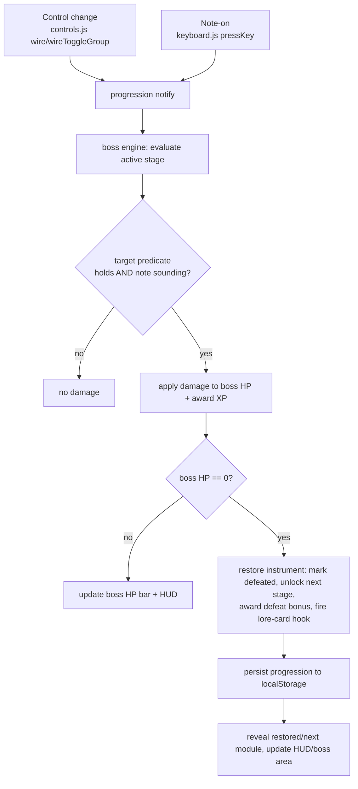
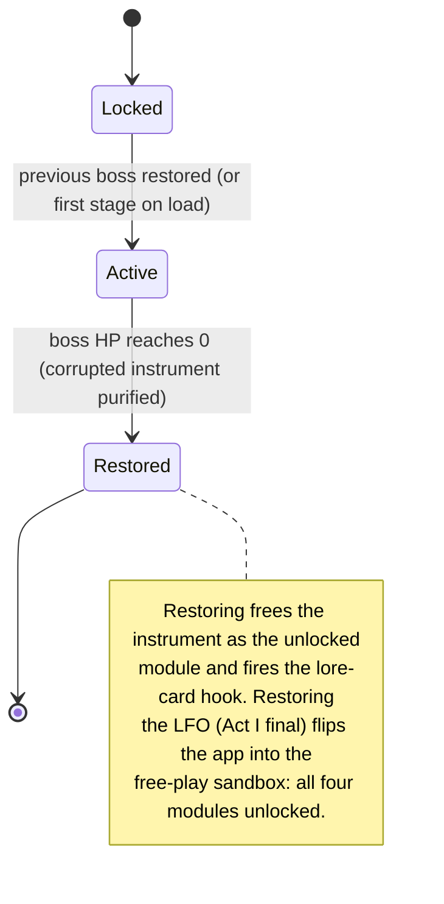

# feat: Synthehol progression, boss engine & vintage identity (Phase 1, Act I)

## Summary

Add a guided progression layer over the existing synth: stages unlock in order,
each ending in a boss fight you win by sculpting that stage's target sound. This
plan covers **Phase 1** — the progression framework, the data-driven boss/challenge
engine, `localStorage` persistence, and **Act I** (the existing Oscillator, Filter,
Envelope, and LFO modules re-framed as stages and bosses). The app starts visually
minimal and **unlocks visual richness with each stage restore** — the full
vintage-hardware identity (cohesive panel, per-era accents, drawn in CSS/SVG) is
earned across Act I, not present from the start. Each Act I boss is a **corrupted
Moog-era instrument** the player *restores* by hitting the target sound; entering a
fight triggers a **dedicated battle-screen layout** (Street Fighter / Dr. Mario
style: synth panel facing the boss, HP bars up top). Act I is themed to the birth
of voltage-controlled synthesis (Bob Moog, Wendy Carlos). Restoring the LFO boss
graduates the player into a free-play sandbox. Acts II–IV and the museum/lore-card
layer are deferred to follow-up plans (see origins).

---

## Problem Frame

Synthehol shows all four modules at once in a generic modern-neon skin, which
overwhelms a cold public beginner, gives no starting point or reason to touch any
control, and carries none of the romance of the instruments it teaches. The
existing teaching panel explains a control only after it's clicked; nothing pulls a
newcomer through the concepts in order. The boss-gated progression turns "learn
synthesis" into a sequence of small, winnable goals, and the vintage identity gives
that journey a place and a story. Phase 1 proves the whole mechanic end to end on
the modules that already exist — and lands the vintage identity now so the
progression UI is built into it rather than re-skinned later.

---

## Scope Boundaries

### In scope (Phase 1)

- Progression state, ordered stages, completion-gated unlocking, XP, persistence.
- Data-driven boss/challenge engine with per-stage target predicates.
- Act I content: Oscillator, Filter, Envelope, LFO as four stages/bosses, themed as corrupted Moog-era instruments.
- Vintage-hardware visual identity (cohesive base + per-era accent system; the Act I/Moog palette) replacing the modern-neon skin, drawn in CSS/SVG.
- Boss-as-corrupted-machine theming: restoration is the unlock; a restoration hook is reserved for the deferred lore-card system.
- Locked/dimmed module presentation, progression HUD, reset control — all in the vintage identity.
- Graduation seam: restoring the Act I final boss (LFO) reveals the four-module free-play sandbox.

### Deferred to Follow-Up Work

- Acts II–IV — noise source, second oscillator, polyphony, step sequencer, MIDI in/out — each its own plan (see origin roadmap).
- The museum + pioneer lore-card content layer (see origin: aesthetic brainstorm) — its own later plan; Phase 1 only reserves the restoration hook.
- Per-era palettes beyond Act I — later acts add their own on the accent system built here.
- The *full-DAW* graduation and the single climactic final boss (origin R13) — they belong to Act IV. Phase 1's graduation reveals only the existing four-module sandbox.
- Match-the-sound / ear-training challenge type (origin R12 keeps the engine extensible for it; not built here).

### Out of scope (product identity)

- Accounts, leaderboards, backend, cross-device sync — progress stays local (origin).
- Project save/load, audio export, effects — natural DAW extensions past the ladder (origin).
- Real recordings, product photos, brand logos/trade dress, real-person likeness images — visuals are original "inspired-by" homage (see origin: aesthetic brainstorm).

---

## Key Technical Decisions

- **Progression state lives in its own module, separate from `S`.** `src/state.js`
  stays the synth-parameter source of truth; progression (stages, XP, unlocks) is a
  new parallel module so the two concerns don't entangle. Mirrors the existing
  one-module-per-concern layout.

- **The boss engine is a pure evaluator fed by events, not a polling loop.** Control
  changes and note-ons notify the engine; it evaluates the active stage's target
  predicate against a snapshot of `S` plus "is a note sounding," and returns damage.
  Keeping evaluation a pure function of `(stage, S, isPlaying)` makes it unit-testable
  without the audio graph or DOM.

- **Stages and bosses are data, not code branches.** A single ordered table defines
  each stage's module, era/instrument theming, copy, boss, and target predicate.
  Adding Act II–IV stages (or a future match-the-sound predicate type) is a data
  edit plus, at most, a new predicate kind — satisfying origin R12 without reworking
  the engine.

- **Damage is discrete per qualifying note-on.** Each note played while the target
  predicate holds chips a fixed chunk of boss HP (origin AE1: "each matching note
  chips HP"). Discrete ticks are deterministic and easy to tune; continuous
  drain-while-held is noted as a tuning alternative in Open Questions.

- **Instrumentation hooks are added once at the choke points, not per control.**
  `wire()` and `wireToggleGroup()` in `src/controls.js` already wrap every control;
  one notify call in each, plus one on note-on in `src/keyboard.js`, connects the
  whole synth to the engine.

- **Keyboard is never gated.** Audio still starts lazily on first key press; locking
  affects only which *modules/concepts* are revealed, never the ability to play
  (origin R2).

- **Vintage identity replaces the modern-neon skin, with a per-era accent system.**
  The app gets a cohesive vintage-hardware look (wood/cream/black panel, chunky
  knobs, engraved labels), drawn entirely in CSS/SVG (no external images, per CSP).
  Accents layer per era via a `data-era` attribute on a root container; Phase 1
  ships the Act I "birth of voltage-controlled synthesis" (Moog) palette, with the
  system structured so later acts add palettes without a reskin. Building this first
  means the progression and boss UI land vintage-correct (see origin: aesthetic
  brainstorm).

- **Bosses are corrupted machines you restore.** Each Act I boss is a corrupted
  Moog-era instrument; meeting the stage target purifies it, and that restoration
  *is* the existing defeat/unlock moment — no separate mechanic, just reframed
  visuals and copy over the same engine (see origin: aesthetic brainstorm).

- **Restoration reserves a lore-card hook; content is deferred.** The engine emits a
  restore event at defeat so a later museum/lore-card layer can award a pioneer card
  (Bob Moog, Wendy Carlos for Act I). Phase 1 wires the hook but ships no museum or
  card content (see origin: aesthetic brainstorm).

- **Visual complexity unlocks stage by stage.** The skin starts minimal; each stage
  restore adds a CSS layer of vintage richness (panel chrome, knob detail, engraved
  labels, era animation). U8 establishes the token and unlock system; U6 applies each
  layer as stages are restored. The full Act I Moog palette is the act-completion
  reward, not the starting default.

- **Boss fights use a dedicated battle-screen layout mode.** Entering a fight
  transitions the page into an arena layout — synth panel (player) facing the
  corrupted instrument (boss), HP bars at top — via a CSS class on a root container.
  The keyboard and audio engine stay live; this is a layout shift, not a page change.
  Exiting (restore or retreat) removes the class and returns to the exploration layout.

---

## High-Level Technical Design

Event-driven flow — a control change or note-on drives evaluation, damage, and the restore/unlock:

Per-stage lifecycle and the Act I graduation seam:

---

## Requirements

Carried from the origin requirements docs; this plan advances the Phase 1 subset.

### Progression & unlocking

- R1. The app opens in the progression starting at the Oscillator stage; later stages start locked.
- R2. The keyboard plays sound from first load; making sound is never gated.
- R3. A stage unlocks the next only when its boss is restored, strictly in order.
- R4. Locked stages are visible but dimmed with a "coming next" teaser, not hidden.
- R5. Progress (unlocked stages, current stage, XP) persists across reloads via `localStorage`, with a reset control.
- R6. After the Act I final boss is restored, the app reveals a free-play sandbox of all four modules. *(Phase 1 graduation seam; full-DAW graduation deferred.)*

### Challenge & boss battles

- R7. Each stage ends in a boss fight that is its ears-first challenge: the boss has a health bar, and producing the stage's target sound while playing damages it.
- R8. The target ("beautiful" for that stage) is defined per stage by its concept; damage comes from the live `S` state meeting the target, not a generic beauty algorithm.
- R9. Restoring a boss completes the stage and triggers the next unlock and the XP reward.
- R10. Each Act I boss is a corrupted Moog-era instrument (a corrupted VCO, the ladder filter, the contour generator, the modulation source), rendered in-app and reacting to the player's sound; restoring it reveals the clean instrument.
- R11. Each boss shows short in-character taunt/coaching copy that doubles as a hint toward the target.
- R12. The boss/challenge engine is data-driven so new challenge types and bosses can be added without reworking it.

### XP & teaching

- R14. A visible XP score accumulates as bosses are damaged and restored; XP never gates an unlock.
- R15. The existing teaching panel keeps explaining each control, framed within a stage around the active boss's target.

### Capability content

- R16. Act I covers the existing modules — Oscillator, Filter, Envelope, LFO — each as its own stage and boss.

### Vintage identity & narrative theming (origin: aesthetic brainstorm)

- R21. The app adopts a cohesive vintage-hardware visual identity (panels, knobs, sliders, engraved labels), replacing the modern-neon skin as the default look.
- R22. A per-era accent system layers on the shared vintage panel (palette, control tint, label flavor); Phase 1 ships the Act I palette themed to the birth of voltage-controlled synthesis (Moog), with the system structured for later acts to add their own.
- R23. All vintage textures and ornamentation are rendered in-app via CSS/SVG; no external image assets (CSP `img-src 'self'`).
- R24. Restoring a boss is the unlock/defeat moment: meeting the stage target purifies the corrupted instrument into its clean form, which becomes the unlocked module.
- R25. Restoration emits a hook reserving where a pioneer lore card (Bob Moog, Wendy Carlos for Act I) will later be awarded; the museum and lore-card content layer is deferred.
- R26. The app starts in a minimal visual state; each stage restore adds a CSS visual layer; the full Act I vintage palette is the act-completion reward.
- R27. Entering a boss fight switches the layout to a battle screen (arena facing view, HP bars at top, taunt text); restoring the boss or retreating switches back; the keyboard stays live throughout.

Deferred to follow-up plans (not advanced here): R13 (climactic final boss), R17–R20 (Acts II–IV capabilities and MIDI no-hard-gate), and the museum/lore-card content layer.

---

## Implementation Units

### U1. Vitest test scaffolding

- **Goal:** Add a dev-only test runner so the pure-logic units have a home for tests.
- **Requirements:** Enables verification for R3, R5, R7–R9.
- **Dependencies:** none.
- **Files:** `package.json` (add `vitest` devDependency + `test` script), `vite.config.js` (add Vitest `test` config, jsdom environment for the few DOM-touching tests), `src/setupTests.js` (new, if needed for jsdom globals).
- **Approach:** Vitest pairs with the existing Vite setup and needs no separate bundler config. Use the `node` environment by default and `jsdom` only where a unit touches the DOM. Nothing here ships to the app — it remains a no-build, CDN-only runtime.
- **Patterns to follow:** Existing `vite.config.js` `defineConfig` shape.
- **Test scenarios:** Test expectation: none -- dev tooling scaffolding. Verify by running the test script and seeing an empty/trivial suite pass.
- **Verification:** `npm test` runs and reports success on an empty or placeholder suite.

### U2. Progression state + persistence

- **Goal:** A single source of truth for progression — ordered stage ids, current stage, unlocked set, XP, defeated bosses — with load/save/reset.
- **Requirements:** R1, R3, R5.
- **Dependencies:** U1.
- **Files:** `src/progression.js` (new), `src/progression.test.js` (new).
- **Approach:** Hold a plain progression object with `load()` (rehydrate from `localStorage`, falling back to a fresh initial state), `save()` (persist after each mutation), `reset()` (clear to initial and persist), and mutators (`unlockNext()`, `addXp(n)`, `markDefeated(id)`). Use a single namespaced key (e.g. `synthehol_progress`). Validate/migrate unknown or malformed stored shapes to the initial state rather than throwing.
- **Patterns to follow:** Module-per-concern style of `src/state.js`; keep this independent of `S`.
- **Test scenarios:**
  - Fresh state: with no stored data, `load()` yields Oscillator active, others locked, XP 0.
  - Covers AE5. Persistence round-trip: after unlocking through a later stage and adding XP, a reload (`save()` then fresh `load()`) restores unlocked stages and XP.
  - Covers AE5. Reset: `reset()` returns to Oscillator-active with XP 0 and persists that.
  - Malformed store: corrupt/old JSON in the key falls back to fresh initial state without throwing.
  - `unlockNext()` advances strictly one stage and is idempotent at the last stage.
- **Verification:** Tests pass; reloading the running app preserves progress and the reset control returns to the first stage.

### U3. Stage & boss definitions

- **Goal:** The data table describing Act I's four stages — each themed as a corrupted Moog-era instrument — with their bosses, copy, target predicates, and era/pioneer theming.
- **Requirements:** R7, R8, R10, R11, R12, R16, R22, R24, R25.
- **Dependencies:** U1.
- **Files:** `src/stages.js` (new), `src/stages.test.js` (new).
- **Approach:** Export an ordered array. Each entry carries `id`, the existing module DOM id (`mod-osc` / `mod-filter` / `mod-adsr` / `mod-lfo`), `era` (Act I = the Moog/birth-of-voltage-controlled-synthesis era), the `instrument` it represents and the `pioneer` reserved for its lore card, stage intro copy, a boss (`name`, `corruptedOf` the instrument, `taunt`/hint copy, `maxHp`, `damagePerHit`), and a `target(S, isPlaying)` predicate. Starter Act I boss→instrument mapping (names illustrative): Oscillator = corrupted VCO/oscillator bank; Filter = the corrupted Moog ladder filter ("Vorth, the Muffled"); Envelope = corrupted contour generator; LFO = corrupted modulation source. Act I pioneers: Bob Moog, Wendy Carlos. Starting predicates (thresholds tunable — see Open Questions):
  - Oscillator: a brighter-than-sine waveform while playing (`S.waveform !== 'sine'`).
  - Filter: low-pass opened bright (`S.filterType === 'lowpass' && S.cutoff > 4000`).
  - Envelope: a plucky stab (`S.attack < 0.05 && S.sustain < 0.3`).
  - LFO: audible movement (`S.lfoDest !== 'none' && S.lfoDepth > 0.3`).
- **Technical design (directional, not implementation spec):** `{ id, moduleId, era, instrument, pioneer, intro, boss: { name, corruptedOf, taunt, maxHp, damagePerHit }, target: (S, isPlaying) => boolean }`.
- **Patterns to follow:** The `TEACHINGS` lookup table shape in `src/teaching.js`.
- **Test scenarios:**
  - Each predicate returns true for a state meeting its target and false for the default `S`.
  - Covers AE1. The Filter predicate is true at `cutoff` above the threshold with low-pass selected, false below it or with another filter type.
  - Ordering: stages are Oscillator → Filter → Envelope → LFO, and every `moduleId` matches an existing module id in `index.html`.
  - Theming: every Act I stage carries the Moog era, a non-empty `instrument`, `pioneer`, and `boss.corruptedOf`.
- **Verification:** Tests pass; predicate thresholds correspond to audibly correct "beautiful" sounds, and each stage is themed to a Moog-era instrument.

### U4. Challenge / boss engine

- **Goal:** Turn control/note events into boss damage, restoration (defeat), unlock, XP, the lore-card hook, and the Act I graduation transition.
- **Requirements:** R3, R7, R8, R9, R12, R14, R6, R24, R25.
- **Dependencies:** U2, U3.
- **Files:** `src/bossEngine.js` (new), `src/bossEngine.test.js` (new).
- **Approach:** Expose a `notify({ S, isPlaying })` entry the hooks call. It reads the active stage from progression (U2), evaluates that stage's `target` (U3), and on a qualifying note-on subtracts `damagePerHit` from the active boss's HP and adds XP. At HP 0 it restores the instrument: mark defeated, award a defeat XP bonus, unlock the next stage, persist, and emit a restore event/hook carrying the stage's instrument + pioneer (the reserved seam for the deferred lore-card layer — no card content here). When the last Act I stage is restored, set a `graduated` flag (consumed by UI in U6/U7). Keep evaluation pure: damage is a function of `(stage, S, isPlaying)`; engine holds only current boss HP plus references to progression.
- **Patterns to follow:** `src/audio.js` `engine` object as a single exported stateful module.
- **Test scenarios:**
  - Covers AE1. Damage on match: a note-on with the target met reduces boss HP by `damagePerHit` and adds XP.
  - No damage off-target: a note-on with the target not met leaves HP and XP unchanged.
  - No damage without a note: a qualifying `S` with `isPlaying` false deals no damage (origin R7 — must be *played*).
  - Covers AE2, AE6. Restore → unlock: enough qualifying hits drop HP to 0, mark the stage restored, award the defeat bonus, and unlock exactly the next stage.
  - Lore-card hook: restoring a boss emits the restore event once, carrying that stage's instrument and pioneer.
  - Graduation: restoring the final Act I stage sets `graduated`.
  - XP never gates: unlock happens on restore regardless of XP total.
- **Verification:** Tests pass; in the app, playing the right sound visibly drains the boss, restores the instrument, and unlocks the next module.

### U5. Control & keyboard instrumentation hooks

- **Goal:** Connect every existing control and note-on to the boss engine with minimal touch.
- **Requirements:** R7, R8, R9.
- **Dependencies:** U4.
- **Files:** `src/controls.js` (modify), `src/keyboard.js` (modify), `src/audio.js` (modify only if a note-sounding flag must be exposed).
- **Approach:** Add one engine notify inside `wire()` and one inside `wireToggleGroup()` so all sliders and toggle groups report changes through a single seam each. Add a notify on note-on in `keyboard.js` `pressKey()`. Pass the engine a snapshot of `S` and whether a note is sounding (`engine.noteOn` / `engine.currentNote` already track this). Do not alter audio behavior.
- **Patterns to follow:** Existing `teach(key)` calls already threaded through these handlers — add the notify alongside, at the same choke points.
- **Test scenarios:**
  - Control change forwards to the engine: a wired slider input triggers exactly one engine notify (spy/mock).
  - Toggle group selection forwards to the engine once per click.
  - Note-on forwards to the engine with `isPlaying` true.
  - Audio unchanged: existing play/teach behavior still fires (no regression in the handler).
- **Verification:** Adjusting any control or playing a key drives the active boss fight; the synth still sounds and teaches exactly as before.

### U8. Vintage visual identity — base skin + per-era accent system

- **Goal:** Establish the minimal starting skin, the per-stage visual unlock system, and the per-era accent mechanism — all in CSS/SVG. The app starts sparse; vintage richness layers in as stages are restored. Foundational for U6 and U7.
- **Requirements:** R21, R22, R23, R26.
- **Dependencies:** none. *(Foundational styling; ordered before U6/U7 because they build on it.)*
- **Files:** `src/style.css` (modify — define a minimal base skin that replaces the neon palette; define CSS custom properties for each visual unlock layer (`--layer-panel-chrome`, `--layer-knob-detail`, `--layer-engrave`, `--layer-era-anim`); define per-era accent properties keyed off a root `data-era` attribute; ship the Act I/Moog accent set), `index.html` (modify — add the root container hook, `data-era` attribute, and a `data-visual-layer` attribute or unlock class list the progression UI increments).
- **Approach:** The base skin is intentionally minimal — clean but not neon. Each restore adds a CSS class or increments an attribute on the root container, activating the next layer of vintage detail via the custom properties defined here. U6 applies the classes/attributes as stages restore. The full Act I Moog palette (warm cream/wood/black) is the class state reached after all four Act I restores — not the starting state. Keep everything pure CSS/SVG (CSP `img-src 'self'`).
- **Patterns to follow:** Existing CSS-variable usage in `src/style.css`; SVG glyphs in `index.html`.
- **Test scenarios:** Test expectation: none — pure styling. Verified visually; optionally assert in jsdom that the root's unlock class list resolves the expected custom properties.
- **Verification:** Visual — the app starts minimal (not the old neon skin, not the full vintage panel); each stage restore visibly adds a layer of vintage richness; the full Act I palette appears after all four restores; no external image requests (CSP clean).

### U6. Progression UI — locking, HUD, reset, graduation reveal, era accents

- **Goal:** Reflect progression state on screen in the vintage identity: lock/dim future modules, show XP + current stage, expose reset, apply the current era's accent, and reveal the sandbox on graduation.
- **Requirements:** R1, R3, R4, R5, R6, R14, R15, R22.
- **Dependencies:** U2, U4, U8.
- **Files:** `index.html` (modify — HUD markup, per-module lock/teaser overlay, reset control), `src/style.css` (modify — locked/dimmed/teaser styles and HUD in the vintage identity tokens from U8), `src/progressionUI.js` (new — apply state→DOM), `src/progressionUI.test.js` (new, jsdom).
- **Approach:** A render function maps progression state to DOM: add a `locked` class + "coming next" teaser to modules past the current stage, mark the active module, show unlocked ones normally, and set the root `data-era` to the current stage's era (Phase 1 = Act I/Moog) so U8's accent system themes the panel. Render the HUD (XP total, current act/stage label) styled in the vintage identity. Wire a reset control to `progression.reset()` then re-render. On `graduated`, remove all locks so every module is free-play (Phase 1 sandbox). Re-render on every engine state change.
- **Patterns to follow:** Module ids in `index.html` (`#mod-osc` etc.); `fillSlider`/`setStatus` DOM-helper style in `src/ui.js`; the `data-era` accent hook from U8.
- **Test scenarios:**
  - Covers AE3. Initial render: only the Oscillator module is active; Filter/Envelope/LFO carry the `locked` class and a teaser.
  - Covers AE2. Unlock render: after the engine unlocks the Filter stage, the Filter module loses `locked` and becomes active.
  - Era accent: the root `data-era` is set to the Act I era on render.
  - HUD reflects XP and current stage after a damage/restore update.
  - Reset: invoking the reset control re-locks all but the Oscillator stage and zeroes the HUD.
  - Graduation: when `graduated` is set, no module carries the `locked` class.
- **Verification:** Visual check — locked modules look dimmed with a teaser, the HUD tracks XP/stage in the vintage identity, reset restarts the journey, and restoring the LFO boss reveals all four modules.

### U7. Boss stage UI, rendering, and battle feedback

- **Goal:** Implement the battle-screen layout mode and render each boss as a corrupted Moog-era instrument with HP bar, taunt, damage feedback, and a restore-on-defeat animation.
- **Requirements:** R7, R10, R11, R15, R24, R27.
- **Dependencies:** U3, U4, U6, U8.
- **Files:** `index.html` (modify — battle-screen wrapper with player side / boss side / HP bar / taunt regions; toggled by a `battle-active` class on a root container), `src/style.css` (modify — battle-screen layout, HP bar, taunt in the vintage identity tokens from U8; the layout shift is pure CSS driven by `battle-active`), `src/boss.js` (new — enter/exit battle mode, render corrupted instrument + HP bar, damage flinch and restore animation), `src/main.js` (modify — init boss UI, hook render into the `animate()` loop).
- **Approach:** When the boss engine activates a stage, `boss.js` adds `battle-active` to the root container; CSS shifts the layout into the arena view (synth panel on one side, boss canvas on the other, HP bars framing the top — Street Fighter / Dr. Mario paradigm). The synth panel stays fully interactive; the keyboard stays live. Render the boss on a canvas using `src/canvas.js` drawing primitives: start with CSS corruption effects (hue-rotate, glitch animation) over a basic instrument silhouette — no complex art required for Phase 1. Animate a flinch on each damage tick. At HP 0, play a restore animation (corruption clears, clean instrument silhouette remains), then remove `battle-active` to return to exploration layout as the module unlock lands. The boss taunt/hint copy displays in the arena.
- **Patterns to follow:** `setupCanvas`/`drawWaveOnCanvas` in `src/canvas.js`; the `animate()` loop in `src/main.js`; vintage tokens from U8; CSS class toggles on root container already used for era accents.
- **Test scenarios:**
  - `battle-active` is added to the root when a stage becomes active and removed after restore (jsdom).
  - HP bar reflects engine HP: rendering at a known HP draws the bar at the correct fill.
  - Taunt copy matches the active stage's boss.
  - Covers AE6. Restore state: at HP 0 the clean instrument visual is shown, not the corrupted one.
  - Covers AE8. Battle-screen transition: layout switches on stage activation and returns on restore.
  - Corruption art, flinch, and restore animation correctness verified visually, not unit-tested.
- **Verification:** Visual check — entering a stage shifts to the arena layout; boss appears corrupted, taunts, flinches on hits, and restores on defeat; layout returns to exploration mode after restore; existing canvases and scope still animate; no console errors.

---

## Acceptance Examples

Carried from origins (Phase 1 subset). Origin AE4 (MIDI no-hard-gate) is deferred with Act IV.

- AE1. **Covers R7, R8.** Given the Filter boss (a corrupted Moog ladder filter) with a dull target, when the player raises cutoff above the stage threshold while playing a note, the boss loses health; below the threshold, no damage.
- AE2. **Covers R3.** Given the Envelope stage is the current frontier, when the player tries to use the LFO stage, it stays locked until the Envelope boss is restored.
- AE3. **Covers R2.** Given a brand-new session with only the Oscillator stage unlocked, when the player presses a key, a tone sounds — no stage need be completed first.
- AE5. **Covers R5.** Given progress unlocked through several stages with XP, when the player reloads, unlocked stages and XP are restored; the reset control returns to the Oscillator stage with zero XP.
- AE6. **Covers R24.** Given a boss at 0 HP, when it is defeated, the corrupted instrument visibly restores to its clean form and the corresponding module unlocks.
- AE7. **Covers R26.** On first load the app is visually minimal; after the Oscillator boss is restored a new visual layer (panel chrome, knob detail, or similar) appears that was absent before.
- AE8. **Covers R27.** When the Oscillator stage activates, the layout shifts to the battle screen (synth panel facing the corrupted VCO, HP bar at top, taunt visible); when the boss is restored, the layout returns to exploration mode.

---

## Risks & Dependencies

- **No existing test harness.** U1 introduces Vitest as a dev dependency; if the project owner wants zero added tooling, the pure-logic units fall back to manual verification. Flagged because it's the one new dependency.
- **Predicate thresholds set "beautiful" by fiat.** The starting target values (cutoff > 4 kHz, etc.) need play-testing to feel fair and musical; wrong thresholds make fights frustrating. Tunable in `src/stages.js` (Open Questions).
- **Themed boss art is more effort than generic creatures.** Each boss must read as a *corrupted* Moog-era instrument that still resolves into a recognizable clean instrument on restore — all in CSS/SVG/canvas under the CSP. Higher design effort than abstract blobs; accepted per origin.
- **Whole-skin replacement risk.** U8 replaces the modern-neon palette across the app; restyle without rebuilding the layout, or existing module/scope/teaching visuals can regress.
- **Per-era accent cohesion.** The accent system must stay cohesive across eras; over-tinting per stage fragments the identity. Phase 1 ships only the Act I palette, which limits exposure.
- **Animation-loop load.** Boss rendering joins the existing `requestAnimationFrame` loop alongside the LFO canvas and scope; keep per-frame work light to avoid jank.

---

## Open Questions

Deferred to implementation:

- Exact per-stage target thresholds and how a "matching" note is sampled (snapshot at note-on vs. sustained check).
- Discrete damage-per-note (planned) vs. continuous drain while the target is held — decide during play-testing.
- The CSS-variable / `data-era` token structure for the per-era accent system.
- How "corrupted vs restored" instrument art is drawn per boss and how many animation states each needs.
- The shape of the restoration lore-card hook event (instrument + pioneer payload), even though the consuming museum/card layer is deferred.
- HUD placement and whether the boss occupies the existing teaching-panel area or a new region.
- Whether XP drives any meta-progression beyond a visible score (origin Open Question).

---

## Sources / Research

- `docs/brainstorms/2026-06-21-synthehol-progression-to-daw-requirements.md` — the boss-progression origin (stages, unlock, XP, graduation).
- `docs/brainstorms/2026-06-21-vintage-aesthetic-and-history-requirements.md` — the aesthetic/history origin reshaping the visual identity (U8), boss framing (U3, U4, U7), per-era accents (U6, U8), and the reserved lore-card hook (U4).
- `src/controls.js` — `wire()` / `wireToggleGroup()` wrap every control and already call `teach(key)`; the single seam for instrumentation (U5).
- `src/state.js` — the `S` parameter object the engine reads to evaluate targets (U3, U4).
- `src/audio.js` — `engine` object tracks `noteOn` / `currentNote`; lazy `startAudio()` on first key keeps the keyboard ungated (R2).
- `src/keyboard.js` — `pressKey()` is the note-on hook point (U5).
- `src/style.css` — the current modern-neon palette and per-module colors being replaced by the vintage identity (U8).
- `index.html` — modules are discrete sections (`#mod-osc`, `#mod-filter`, `#mod-adsr`, `#mod-lfo`) to lock/dim/theme (U6, U8); `#teach-title`/`#teach-body`/`#teach-canvas` for stage framing (R15); existing inline SVG glyphs as a vintage-rendering pattern.
- `src/canvas.js` — `setupCanvas` + drawing primitives for boss/instrument rendering (U7).
- `src/teaching.js` — `TEACHINGS` table shape to mirror for stage/boss copy (U3).
- `src/main.js` — `animate()` loop and load-time draw sequence to hook boss rendering into (U7).
- `CLAUDE.md` (Synthehol) — "fun first, accurate second", no-build architecture, and the CSP that forces CSS/SVG-only visuals.
