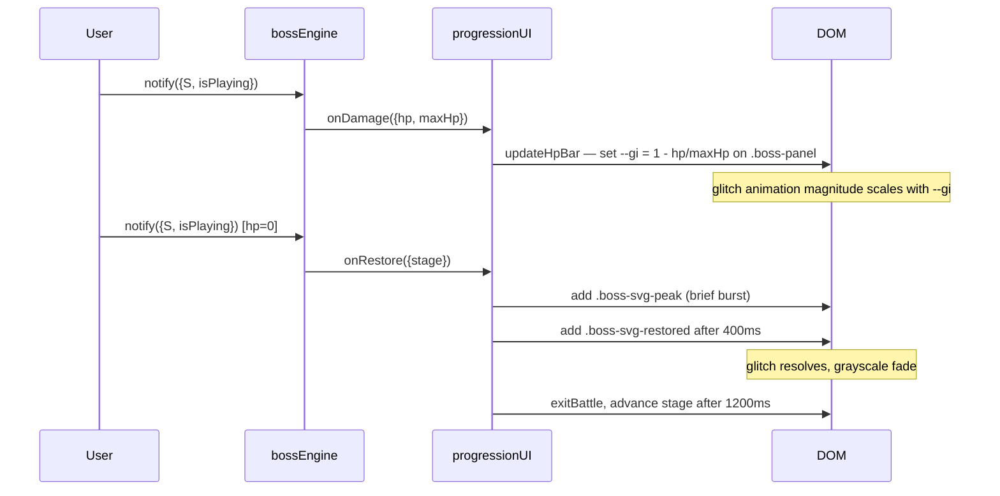
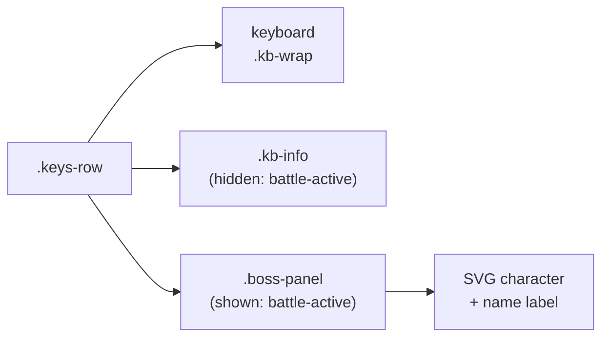

# feat: Boss character panel, glitch effects, and historical context

## Summary

Add a visual boss character panel — one unique SVG rack-unit illustration per Act I boss, with CSS glitch effects that intensify as HP drops — positioned to the right of the keyboard during battle. Surface historical context about each module's inventor in two places: an enriched stage-intro strip shown at battle start, and a persistent ⓘ button on each module header that populates the teaching panel on demand.

---

## Requirements

**Boss character panel**

- R1. A boss panel appears to the right of the keyboard when `battle-active` is set, replacing the keyboard shortcut hints for the duration of the battle.
- R2. Each Act I boss has a unique SVG character illustration authored in code; no image assets.
- R3. Each SVG uses visual motifs drawn from the module it guards (oscillator: knob-eyes + waveform mouth; filter: cutoff-slider eyes + constrained-wave mouth; envelope: ADSR-shaped mouth + long-tail eyes; LFO: frozen-sine eyes + flatline mouth).
- R4. CSS glitch effects layer over the SVG during battle; intensity scales from 0 to 1 as HP drops from 100% to 0%.
- R5. On boss defeat, glitch effects resolve to a `boss-svg-restored` visual state before the panel transitions away.
- R6. Boss panel is absent and shortcut hints are shown when no battle is active: on fresh load after graduation and between stage transitions.

**Historical context — stage-intro strip**

- R7. When a battle begins, the stage-intro strip shows: pioneer name, year/era, instrument name, and one historical fact sentence.
- R8. The lore strip auto-dismisses after 5 seconds; pressing any piano key also dismisses it.
- R9. The lore strip does not obscure module controls or the keyboard.

**Historical context — lore button**

- R10. Each module header has a small ⓘ button, visible at all times including while the module is locked.
- R11. Clicking ⓘ populates the teaching panel with the module's historical content using the existing `teach()` mechanism.
- R12. The lore button is functional before, during, and after the boss fight for that module.

**Stage data**

- R13. `src/stages.js` gains two new fields per stage: `historyYear` (string) and `historyFact` (one sentence).

---

## Key Technical Decisions

**Boss SVG markup in `src/bossArt.js`:** Boss SVG strings live in a dedicated module rather than inlined in HTML or `progressionUI.js`. This keeps character art authoring isolated, prevents `progressionUI.js` from bloating, and makes the four illustrations easy to find and edit. The module exports a single `BOSS_SVG` map keyed by stage `id`.

**CSS custom property `--gi` for glitch intensity:** HP-proportional glitch cannot be driven by a CSS class alone. Setting `--gi` (range 0.0–1.0) inline on the boss panel element lets animation keyframes reference `calc(var(--gi) * <max-value>)` so glitch magnitude scales continuously without toggling classes on every damage tick. `updateHpBar()` in `progressionUI.js` sets it alongside the HP fill width, since it already fires on every `onDamage` callback.

**Restored state as a CSS class toggle on the same SVG:** A `.boss-svg-restored` class (disabling animation, resetting filter, applying `opacity: 0.7 grayscale(0.5)`) keeps the component count at one SVG per boss. The victory moment is communicated by the glitch resolving, not by a second illustration.

**Stage-intro lore as structured child spans:** The lore upgrade replaces the current `textContent`-on-single-span approach with three child `<span>` elements (`#stage-intro-pioneer`, `#stage-intro-instrument`, `#stage-intro-fact`), each set via `textContent`. Avoids `innerHTML` on data-derived strings; allows per-element CSS formatting.

**Lore `TEACHINGS` entries use no-op draw functions:** Historical lore has no relevant waveform visualization. The draw function calls `setupCanvas(canvas)` then returns — consistent with the "LFO off" pattern in `teaching.js`.

**Lore button handlers wired in `initProgressionUI()`:** Follows the reset button pattern (progressionUI.js:22–35): `querySelectorAll('.lore-btn')` + individual listeners calling `teach('lore-<id>')`. Consistent with the convention that `progressionUI.js` is the only file that touches DOM for progression concerns (see CLAUDE.md).

---

## High-Level Technical Design

### Damage → glitch intensity flow



### keys-row layout during battle



---

## Implementation Units

### U1. Stage history data

**Goal:** Add `historyYear` and `historyFact` to all four stage entries in `src/stages.js`.

**Requirements:** R13.

**Dependencies:** none.

**Files:**
- `src/stages.js` (modify)
- `src/stages.test.js` (modify)

**Approach:** Add two fields to each stage object. Historical content:

| Stage | historyYear | historyFact |
|-------|-------------|-------------|
| osc | "1964" | "Bob Moog debuted the first voltage-controlled synthesizer modules at the AES convention in October 1964, giving composers electronic control over pitch for the first time." |
| filter | "1965" | "Moog's transistor ladder filter — introduced in his 1965 commercial modules — produced a warm resonance that became the defining sound of the synthesizer era." |
| envelope | "1968" | "Wendy Carlos's 1968 album 'Switched-On Bach' demonstrated that the Moog's contour generators could match the attack and decay of acoustic instruments with uncanny expressiveness." |
| lfo | "1970" | "The Minimoog Model D (1970), which Carlos helped refine, collapsed the modular patch cables of earlier synthesizers into a single playable instrument with an integrated LFO." |

**Test scenarios:**
- All four stages have a `historyYear` field of type string.
- All four stages have a `historyFact` field of type string with length > 20 characters.
- `historyYear` values are four-digit year strings (`/^\d{4}$/`).

**Verification:** `npm test` passes; `stages.test.js` covers the new fields.

---

### U2. Boss character SVG artwork

**Goal:** Author four unique SVG rack-unit face illustrations in `src/bossArt.js`.

**Requirements:** R2, R3.

**Dependencies:** none (can land in parallel with U1).

**Files:**
- `src/bossArt.js` (create)

**Approach:** Export a single `BOSS_SVG` object keyed by stage id (`'osc'`, `'filter'`, `'envelope'`, `'lfo'`). Each value is a self-contained SVG string.

Visual language per boss — follow the rack-unit face convention from the brainstorm sample (body rect with a face panel, knob-elements as eyes, waveform elements as mouth, patch connectors as limbs):

- **Vox Corruptus** (`osc`): dual large knob-eyes, sawtooth waveform mouth, VU-meter brow strip, two patch cable connectors hanging below.
- **The Muffled** (`filter`): rectangular slider-eyes (one nearly closed), narrow bandpass curve mouth, heavy arching filter-slope eyebrows, noise-stipple texture on body.
- **Dronekeeper** (`envelope`): ADSR-curve mouth with a long flat sustain line, eyes styled as attack/release knobs set to maximum values, a slow decay arc across the brow.
- **The Still** (`lfo`): sine-wave eyes drawn as horizontal flat lines, horizontal flatline mouth, two antenna nubs that hang limp rather than oscillating.

SVG conventions to match the existing wave-button SVGs in `index.html`: `viewBox="0 0 140 110"`, `fill="none"` for line art, `stroke="currentColor"` for theming, `stroke-width="1.5"`, `stroke-linecap="round"`. Use `currentColor` wherever possible so the character inherits color from the boss panel's CSS context. Fixed fills (e.g. dark body rect) use literal hex values that work against the dark `--surface` background.

**Patterns to follow:** Wave button SVGs at `index.html:47–70`; brainstorm sample SVG character for Vox Corruptus (generated during the brainstorm session).

**Test scenarios:**
- Test expectation: none — SVG markup has no behavioral logic; verification is visual via preview.

**Verification:** Boss panel (U3 + U5) renders each boss character correctly; all four display without rendering errors in the browser.

---

### U3. Boss panel DOM and layout CSS

**Goal:** Add the boss panel container to `index.html` and the CSS to show/hide it in sync with `battle-active`.

**Requirements:** R1, R6.

**Dependencies:** U2 (SVG strings exist before wiring them in U5, but the DOM container is independent).

**Files:**
- `index.html` (modify)
- `src/style.css` (modify)

**Approach:**

DOM: add a `.boss-panel` div as a third sibling inside `.keys-row`, after `.kb-info`:

```html
<div class="boss-panel" id="boss-panel">
  <div class="boss-svg-wrap"></div>
  <div class="boss-panel-name" id="boss-panel-name"></div>
</div>
```

CSS rules:
- `.boss-panel { display: none; flex-direction: column; align-items: center; gap: 8px; min-width: 160px; }` — hidden by default.
- `.battle-active .boss-panel { display: flex; }` — shown during battle.
- `.battle-active .kb-info { display: none; }` — shortcut hints hidden during battle.
- `.boss-svg-wrap svg { width: 140px; height: 110px; display: block; }` — consistent sizing for all four boss SVGs.
- `.boss-panel-name { font-size: 11px; color: var(--era-accent); font-family: var(--font-mono, monospace); letter-spacing: 0.08em; text-transform: uppercase; }` — boss name label beneath SVG.

**Test scenarios:**
- Test expectation: none — layout is CSS-driven; verification is visual.

**Verification:** Without `battle-active`, `.boss-panel` is absent and `.kb-info` is visible. With `battle-active` added to `<main>`, the panel appears and shortcut hints hide.

---

### U4. CSS glitch animation system

**Goal:** Define the CSS custom property–driven glitch animation and the restored-state class.

**Requirements:** R4, R5.

**Dependencies:** U3 (`.boss-panel` and `.boss-svg-wrap` selectors exist).

**Files:**
- `src/style.css` (modify)

**Approach:**

Add `@keyframes boss-svg-glitch` near the existing `boss-glitch` keyframes (style.css ~line 497). The new keyframe uses `calc()` against `--gi`:

```css
@keyframes boss-svg-glitch {
  0%, 89%  { transform: translate(0, 0);
             filter: hue-rotate(0deg) saturate(1) brightness(1); }
  90%      { transform: translate(calc(var(--gi, 0) * 4px), 0);
             filter: hue-rotate(calc(var(--gi, 0) * 120deg))
                     saturate(calc(1 + var(--gi, 0) * 4))
                     brightness(calc(1 - var(--gi, 0) * 0.3)); }
  95%      { transform: translate(calc(var(--gi, 0) * -3px), calc(var(--gi, 0) * 1px));
             filter: hue-rotate(calc(var(--gi, 0) * -60deg)); }
  100%     { transform: translate(0, 0); filter: none; }
}
```

Add a class `.boss-svg-active` that applies the animation:

```css
.boss-svg-active {
  animation: boss-svg-glitch 0.5s infinite;
}
```

Add the restored-state class:

```css
.boss-svg-restored {
  animation: none;
  filter: grayscale(0.5) opacity(0.7);
  transition: filter 0.8s ease, opacity 0.8s ease;
}
```

`--gi` is set as an inline style on `.boss-panel` by `progressionUI.js`. At battle start it is `0`; it increases to `1.0` as HP reaches 0.

**Test scenarios:**
- Test expectation: none — animation behavior is visual; verified via preview with HP drain.

**Verification:** At full HP the SVG character is clean. As HP drops to ~50%, visible glitch appears. At 0% HP (just before restore), glitch is at maximum intensity.

---

### U5. Boss panel JS wiring

**Goal:** Wire the boss panel to progression events: show the correct SVG at battle start, update `--gi` on each damage tick, and trigger the restored state on defeat.

**Requirements:** R1, R4, R5, R6.

**Dependencies:** U1, U3, U4 (data, DOM, and CSS animation classes must exist).

**Files:**
- `src/progressionUI.js` (modify)
- `src/bossArt.js` (import, created in U2)

**Approach:**

Import `BOSS_SVG` from `./bossArt.js`.

Add a helper `loadBossCharacter(stage)`:
- Finds `#boss-panel` and `#boss-panel-name`.
- Sets `.boss-svg-wrap` innerHTML to `BOSS_SVG[stage.id]`.
- Sets `#boss-panel-name` textContent to `stage.boss.name`.
- Removes `.boss-svg-restored`, adds `.boss-svg-active` to the SVG element.
- Sets `--gi` to `'0'` on `#boss-panel`.

Call `loadBossCharacter(stage)` at the end of `enterBattle()` (after the existing module corruption logic).

Extend `updateHpBar(hp, maxHp)` to also set `--gi`:
```js
const panel = document.getElementById('boss-panel');
if (panel) panel.style.setProperty('--gi', (1 - hp / maxHp).toFixed(3));
```

In `handleRestore(stage)`, before the existing `exitBattle()` call:
- Set `--gi` to `'1'` momentarily (peak burst).
- After 400ms: remove `.boss-svg-active`, add `.boss-svg-restored` on the SVG element.
- The existing 1200ms `setTimeout` then advances the stage; `loadBossCharacter` on the next `enterBattle()` call will reset the panel.

In `initProgressionUI()`, guard: if `bossEngine.graduated`, ensure `#boss-panel` stays hidden (already handled by `enterBattle()` being guarded on `bossEngine.graduated`).

**Patterns to follow:** `updateHUD()` and `handleRestore()` in `progressionUI.js`; the reset button wiring at lines 22–35.

**Test scenarios:**
- Test expectation: none — DOM wiring requires a browser environment; verified via preview.

**Verification:** Fresh load shows panel hidden. After `initProgressionUI()` with an active stage, `battle-active` class exists, boss SVG renders in panel. Damaging the boss updates `--gi` proportionally. After defeating a boss the restored SVG state appears before the next boss's character loads.

---

### U6. Stage-intro lore upgrade

**Goal:** Enrich the stage-intro strip to display pioneer, instrument/year, and historical fact alongside the existing intro sentence.

**Requirements:** R7, R8, R9.

**Dependencies:** U1 (`historyYear` and `historyFact` fields must exist in stage data).

**Files:**
- `index.html` (modify)
- `src/progressionUI.js` (modify)
- `src/style.css` (modify)

**Approach:**

Replace the current `<span id="stage-intro-text">` in `index.html` with a structured interior:

```html
<div class="stage-intro" id="stage-intro">
  <span class="stage-intro-pioneer" id="stage-intro-pioneer"></span>
  <span class="stage-intro-sep"> — </span>
  <span class="stage-intro-instrument" id="stage-intro-instrument"></span>
  <span class="stage-intro-fact" id="stage-intro-fact"></span>
</div>
```

Update `showStageIntro()` in `progressionUI.js`:
- Populate `#stage-intro-pioneer` with `stage.pioneer`.
- Populate `#stage-intro-instrument` with `stage.instrument + ' (' + stage.historyYear + ')'`.
- Populate `#stage-intro-fact` with `stage.historyFact`.
- Change the dismiss timeout from 4000ms to 5000ms (R8).
- Wire the first-keypress dismiss: add a one-shot `keydown` listener on `document` that removes `visible` and removes itself. The existing `controls.js` `keydown` handler calls `playNote` — the dismiss listener must be separate and fire first (or after, order doesn't matter for correctness).

CSS: expand `.stage-intro.visible` `max-height` from `48px` to `120px` to accommodate the multi-line content. Add layout styles for the new child spans:

```css
.stage-intro-pioneer { font-weight: 500; color: var(--era-accent); font-size: 12px; }
.stage-intro-sep     { color: var(--text-dim); font-size: 12px; }
.stage-intro-instrument { color: var(--text-dim); font-size: 12px; }
.stage-intro-fact    { display: block; margin-top: 3px; font-size: 11px; color: var(--text-dim); }
```

**Patterns to follow:** Existing `showStageIntro()` at `progressionUI.js:83–97`; `.stage-intro` CSS at `style.css:~561`.

**Test scenarios:**
- Test expectation: none — DOM rendering and CSS transitions are visual; verified via preview.

**Verification:** On battle start, the intro strip expands to show "Bob Moog — Moog 901 Oscillator Bank (1964)" on the first line and the historical fact on the second. Strip auto-dismisses after 5 seconds. Pressing a piano key dismisses it immediately.

---

### U7. Module lore buttons and teaching panel integration

**Goal:** Add a ⓘ button to each module header and wire it to populate the teaching panel with historical content.

**Requirements:** R10, R11, R12.

**Dependencies:** U1 (`historyYear` and `historyFact` are used as lore body text in TEACHINGS entries).

**Files:**
- `index.html` (modify — four module headers)
- `src/teaching.js` (modify — add four TEACHINGS entries)
- `src/progressionUI.js` (modify — wire click handlers)
- `src/style.css` (modify — `.lore-btn` styles)

**Approach:**

`index.html`: Add a `<button class="lore-btn" data-lore="osc" aria-label="Oscillator history">ⓘ</button>` inside `.module-header` for each of the four modules (after `.mod-subtitle`). The `data-lore` attribute matches the stage `id`.

`src/style.css`: Style `.lore-btn` to be visually minimal and always clickable:
```css
.lore-btn {
  background: none;
  border: none;
  padding: 0 0 0 4px;
  font-size: 13px;
  color: var(--text-dim);
  cursor: pointer;
  pointer-events: auto;   /* override .module.locked pointer-events: none */
  position: relative;
  z-index: 11;            /* above .mod-lock z-index: 10 */
  transition: color 0.15s;
}
.lore-btn:hover { color: var(--era-accent); }
```

`src/teaching.js`: Add four entries to `TEACHINGS`:
```js
'lore-osc': {
  title: 'Bob Moog · 1964',
  body: 'Bob Moog debuted the first voltage-controlled synthesizer modules at the AES convention in October 1964...',
  draw: (c) => { setupCanvas(c); }   // no-op
},
// … 'lore-filter', 'lore-envelope', 'lore-lfo' following the same shape
```

Body text is the `historyFact` from the corresponding stage (duplicate the strings; `teaching.js` does not import `stages.js` — keep the synth layer / progression layer separation).

`src/progressionUI.js`: In `initProgressionUI()`, after the reset button wiring:
```js
document.querySelectorAll('.lore-btn').forEach(btn => {
  btn.addEventListener('click', () => teach('lore-' + btn.dataset.lore));
});
```

Import `{ teach }` from `'./teaching.js'` at the top of `progressionUI.js`.

**Patterns to follow:** Reset button handler in `progressionUI.js:22–35`; `TEACHINGS` entries in `teaching.js`; `teach()` call pattern in `controls.js`.

**Test scenarios:**
- `TEACHINGS` in `teaching.js` has keys `'lore-osc'`, `'lore-filter'`, `'lore-envelope'`, `'lore-lfo'`.
- Each lore entry has a `title` (non-empty string), `body` (non-empty string), and `draw` (function).
- Lore `title` values include the pioneer name (e.g., `'lore-osc'.title` includes `'Moog'`).

**Verification:** Clicking ⓘ on the Oscillator module populates `#teach-title` with "Bob Moog · 1964" and `#teach-body` with the historical fact. Clicking ⓘ on a locked module still works (pointer-events override is effective). Clicking a synth control afterwards replaces the lore content with the normal teaching (existing behavior unchanged).

---

## Scope Boundaries

**Deferred for later**
- Act II–IV boss SVG characters (same pattern; designed when each Act ships).
- Sound effects on HP loss (synth-based hit sounds).
- Boss panel responsive layout for narrow viewports.

**Out of scope**
- User-supplied sprite or image assets.
- Localization of historical text.

---

## Sources & Research

- Origin requirements doc: `docs/brainstorms/2026-06-22-boss-visuals-historical-context-requirements.md`
- Grounding dossier (grounding scout): `/tmp/compound-engineering/ce-brainstorm/boss-visuals-history/grounding.md`
- Existing boss-corrupted animation: `src/style.css:492–510` (pattern for new glitch keyframes)
- Existing battle-active cascade: `src/style.css:643–672` (pattern for `.battle-active .boss-panel` show/hide)
- `showStageIntro()`: `src/progressionUI.js:83–97` (function being extended in U6)
- `updateHpBar()`: `src/progressionUI.js:78–81` (extended in U5 to set `--gi`)
- `handleRestore()`: `src/progressionUI.js:123–149` (extended in U5 for restored SVG state)
- `teach()` and `TEACHINGS` shape: `src/teaching.js:76–82` (pattern for U7 lore entries)
- `.module.locked` pointer-events override: `src/style.css:581` (informs U7 `.lore-btn` z-index)
- `.mod-lock` z-index: `src/style.css` (lock overlay at z-index 10; lore button needs z-index 11)
- `data-layers` cascade pattern: `src/style.css` (reference for CSS custom property pattern used in U4)
- Wave button SVG conventions: `index.html:47–70` (SVG authoring style for U2)
